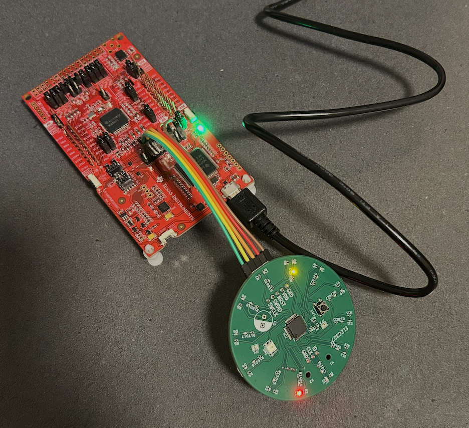

# Embedded LED Clock

A simple LED clock firmware for the TI MSPM0G3507. Two concentric rings of LEDs: outer ring shows hours (1–12), inner ring shows seconds. Includes a button for setting time and brightness.

**Note:** This was a class project. Development was done in a separate private course repo; this repo is a single push of the finished project for personal backup and portfolio use.

## Demo

Video demo: https://youtu.be/_AghdqvLePY

## Hardware

- **MCU:** TI MSPM0G3507
- **Board:** Custom LED board with 12+12 LEDs and one button

## Project layout

- `lab2.c` — main entry, timer setup, standby wakeups
- `state_machine_logic.c/h` — clock state machine (normal/set hour/set minute, PWM dimming)
- `initialize_leds.c/h` — GPIO and LED init
- `delay.c/h` — delay utilities
- `led_board.h` — LED/button pin mapping and masks
- `targetConfigs/` — TI Code Composer / CCS target config for MSPM0G3507

## Build

Use TI Code Composer Studio (or CCS CLI) with the included target config. No other dependencies.

